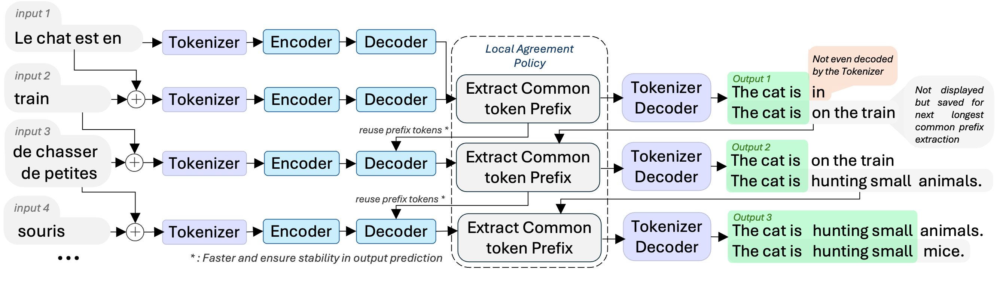

<h1 align="center">NoLanguageLeftWaiting</h1>

**Streaming translation for 200 languages, using NLLB models with KV-cache reuse strategies for real-time applications**

**Work in progress**

Based on [NLLB](https://arxiv.org/abs/2207.04672). Uses [LocalAgreement policy](https://www.isca-archive.org/interspeech_2020/liu20s_interspeech.pdf). [HuggingFace transformers](https://huggingface.co/docs/transformers/model_doc/auto#transformers.AutoModelForSeq2SeqLM) implementation only.

Built for [WhisperLiveKit](https://github.com/QuentinFuxa/WhisperLiveKit)
