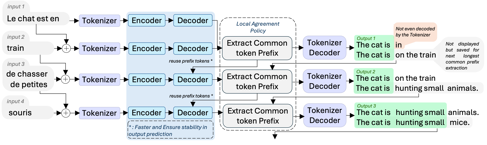
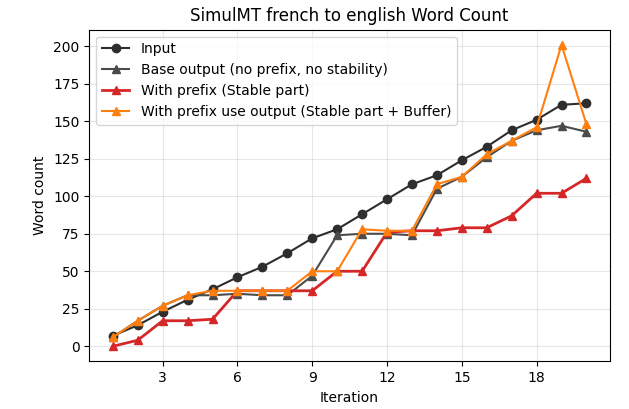

<h1 align="center">NoLanguageLeftWaiting</h1>

<p align="center">

</p>

<p align="center">

</p>

Converts [NoLanguageLeftBehind](https://arxiv.org/abs/2207.04672) translation model to a SimulMT (Simultaneous Machine Translation) model, optimized for live/streaming use cases.

> Based offline models such as NLLB suffer from eos token and punctuation insertion, inconsistent prefix handling and exponentially growing computational overhead as input length increases. This implementation aims at resolving that.


- [LocalAgreement policy](https://www.isca-archive.org/interspeech_2020/liu20s_interspeech.pdf)
- [HuggingFace transformers](https://huggingface.co/docs/transformers/model_doc/auto#transformers.AutoModelForSeq2SeqLM) implementation only.
- Built for [WhisperLiveKit](https://github.com/QuentinFuxa/WhisperLiveKit)
- 200 languages. See [supported_languages.md](supported_languages.md) for the full list.
- Working on implementing a speculative/self-speculative decoding for a faster decoder, using 600M as draft model, and 1.3B as main model. Refs: https://arxiv.org/pdf/2211.17192:  https://arxiv.org/html/2509.21740v1, 

## Installation

```bash
pip install nllw
```
> The textual frontend is not installed by default.


## Quick Start

1. Demo interface :
```bash
python textual_interface.py
```

2. Use it as a package
```python
import nllw

model = nllw.load_model(
    src_langs=["fra_Latn"],
    nllb_backend="transformers",
    nllb_size="600M"
)
translator = nllw.OnlineTranslation(
    model,
    input_languages=["fra_Latn"],
    output_languages=["eng_Latn"]
)

translator.insert_tokens(tokens)
validated, buffer = translator.process()

print(f"Stable: {validated[0].text}")
print(f"Buffer: {buffer.text}")
```


## Input vs Output length:

Succesfully maintain output length, even if stable prefix tends to take time to grow.

<p align="center">

</p>
