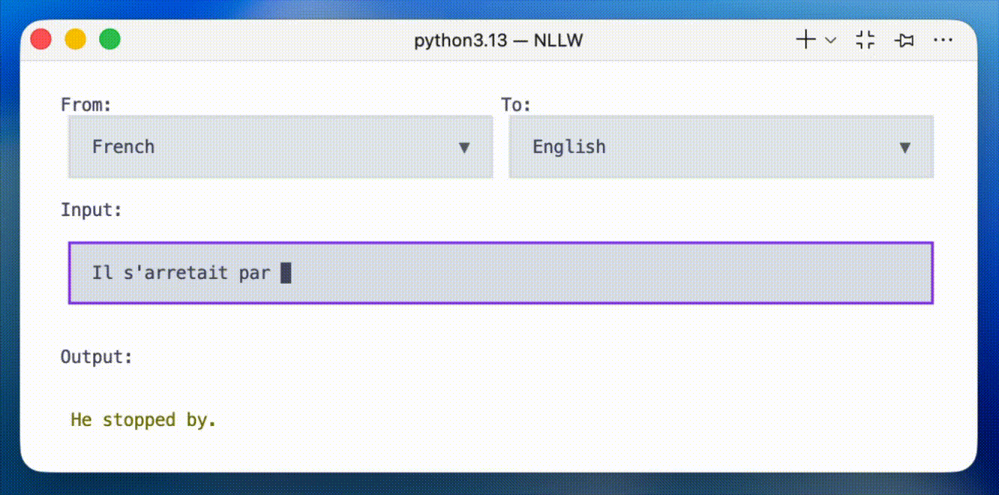

<h1 align="center">NoLanguageLeftWaiting</h1>

<p align="center">

</p>

<p align="center">

</p>

Converts [NoLanguageLeftBehind](https://arxiv.org/abs/2207.04672) translation model to a SimulMT (Simultaneous Machine Translation) model, optimized for live/streaming use cases.

> Based offline models such as NLLB suffer from eos token and punctuation insertion, inconsistent prefix handling and exponentially growing computational overhead as input length increases. This implementation aims at resolving that.

- 200 languages
- [LocalAgreement policy](https://www.isca-archive.org/interspeech_2020/liu20s_interspeech.pdf)
- [HuggingFace transformers](https://huggingface.co/docs/transformers/model_doc/auto#transformers.AutoModelForSeq2SeqLM) implementation only.
- Built for [WhisperLiveKit](https://github.com/QuentinFuxa/WhisperLiveKit)


## Quick Start

```bash
python textual_interface.py
```

## Input vs Output length:

Succesfully maintain output length, even if stable prefix tends to take time to grow.

<p align="center">

</p>
